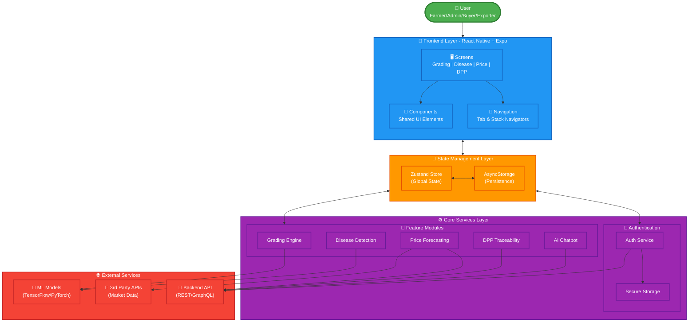

# Rubber Intelligence App 🌿📱

The **Rubber Intelligence App** is a comprehensive mobile application designed to modernize and streamline the rubber industry. Built with **React Native** and **Expo**, it empowers farmers, buyers, exporters, researchers, and administrators with advanced tools for grading, disease detection, price forecasting, and supply chain traceability.

## 🚀 Key Features

### 1. 🍂 Automated Grading System : IT22355928
- **Smart Grading**: Uses AI/ML to analyze rubber sheet quality from images.
- **Standards Compliance**: Grades against industry standards (RSS1, RSS2, etc.).
- **Consistency**: Reduces human error and ensures fair pricing.

### 2. 🦠 Disease Detection GPS Alerting System : IT22563750
- **Instant Diagnosis**: Capture photos of rubber leaves or trunks to detect diseases and alerting system.
- **Treatment Suggestions**: tailored recommendations for disease management.
- **Early Warning**: Helps prevent widespread outbreaks through notification system.

### 3. 📈 Price Forecasting : IT22584090
- **Market Insights**: AI-driven predictions for rubber prices.
- **Trend Analysis**: Historical data visualization to aid decision-making.
- **Alerts**: Notifications for significant market shifts.

### 4. 🔗 Digital Product Passport (DPP) : IT22625298
- **Traceability**: End-to-end tracking of rubber batches from farm to export.
- **Transparency**: Verifiable data for sustainable and ethical sourcing.
- **QR Scanning**: Easy access to product history via QR codes.

### 5. 📊 Monitoring Dashboard : IT22584090
- **Real-time Data**: For Admins and Researchers to monitor industry health.
- **Regional Analytics**: Production stats and disease heatmaps.

### 6. 🤖 AI Chatbot
- **Assistant**: 24/7 support for farmers and users.
- **Knowledge Base**: Answers questions about farming practices, app usage, and more.

## 🛠 Tech Stack

- **Framework**: [React Native](https://reactnative.dev/) with [Expo](https://expo.dev/)
- **Language**: [TypeScript](https://www.typescriptlang.org/)
- **Navigation**: [React Navigation 7](https://reactnavigation.org/) (Bottom Tabs, Native Stack)
- **State Management**: [Zustand](https://github.com/pmndrs/zustand)
- **Networking**: [Axios](https://axios-http.com/)
- **UI/UX**: 
  - `react-native-vector-icons` (Ionicons)
  - `expo-linear-gradient`
  - `react-native-svg`
  - `react-native-chart-kit`

## 🏗 Architecture



## 📂 Project Structure

```
src/
├── features/             # Feature-specific modules
│   ├── auth/             # Authentication (Login, Register)
│   ├── chatbot/          # AI Chatbot implementation
│   ├── diseaseDetection/ # Disease diagnosis screens & logic
│   ├── dpp/              # Digital Product Passport & Traceability
│   ├── grading/          # Rubber grading logic
│   ├── monitoring/       # Admin/Researcher dashboards
│   └── priceForecasting/ # Price charts & prediction models
├── navigation/           # Navigation configuration (Stacks, Tabs)
├── store/                # Global state (Zustand)
├── shared/               # Reusable components & styles
└── utils/                # Helper functions
```

## 🏁 Getting Started

### Prerequisites
- **Node.js** (LTS version recommended)
- **Expo Go** app on your mobile device (iOS/Android) or an Emulator.

### Installation

1.  **Clone the repository**:
    ```bash
    git clone <repository-url>
    cd rubber-intelligence-app
    ```

2.  **Install dependencies**:
    ```bash
    npm install
    # or
    yarn install
    ```

### Running the App

1.  **Start the development server**:
    ```bash
    npx expo start
    ```

2.  **Open the app**:
    - **Physical Device**: Scan the QR code displayed in the terminal using the **Expo Go** app.
    - **Android Emulator**: Press `a` in the terminal.
    - **iOS Simulator**: Press `i` in the terminal.
    - **Web**: Press `w` in the terminal.

## 🤝 Contributing

Contributions are welcome! Please follow these steps:
1.  Fork the repository.
2.  Create a new branch (`git checkout -b feature/YourFeature`).
3.  Commit your changes.
4.  Push to the branch.
5.  Open a Pull Request.

---
*Empowering the Rubber Industry with Technology.*
