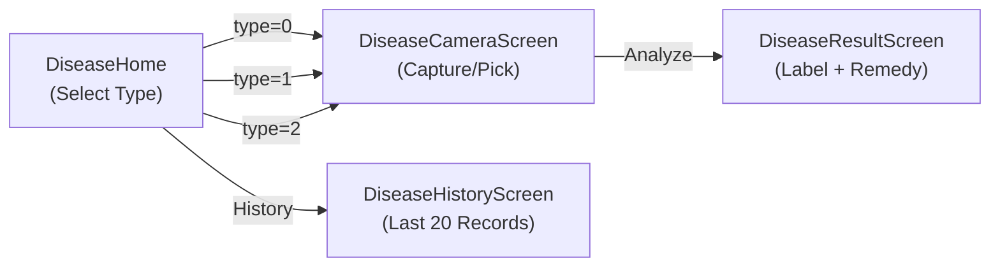

# Disease Detection Feature — Frontend

## Overview

The Disease Detection feature is a React Native (Expo) module that provides a mobile interface for identifying **three types of rubber plantation threats**: leaf diseases, pests, and weeds. Users capture or select a photo, which is sent to the backend API for AI-powered analysis. **Output is restricted to trained classes only** — predictions outside the model boundary are shown as "Unidentified" (rejected alert).

## User Flow



1. **Home Screen** — User selects detection type: Leaf Disease (0), Pest (1), or Weed (2)
2. **Camera Screen** — Capture a photo with the camera or pick from gallery
3. **Result Screen** — View AI prediction: label, confidence %, severity badge, and remedy
4. **History Screen** — Browse the last 20 detection records with pull-to-refresh

## Folder Structure

```
diseaseDetection/
├── DiseaseNavigator.tsx           # Stack navigator + home screen with menu buttons
├── index.ts                       # Barrel export
├── screens/
│   ├── DiseaseCameraScreen.tsx    # Camera capture + gallery pick + analyze
│   ├── DiseaseResultScreen.tsx    # Display prediction result + remedy
│   └── DiseaseHistoryScreen.tsx   # List of past detection records
├── services/
│   └── diseaseService.ts         # API calls (detect + getHistory)
└── README.md
```

## Screens

### DiseaseNavigator / Home Screen

- Uses `createNativeStackNavigator` with 4 routes
- Home screen displays 4 `MenuButton` cards: Leaf Disease, Pest Detection, Weed Identification, and Recent History
- Passes detection `type` as a route param (0/1/2) to the camera screen

### DiseaseCameraScreen

- Uses `expo-camera` (`CameraView`) for live photo capture
- Supports **gallery selection** via `expo-image-picker` (single image, 4:3 aspect, quality 0.5)
- After capture/pick, previews the image with **Retake** and **Analyze** buttons
- On "Analyze": calls `DiseaseService.detect(imageUri, type)` → navigates to result screen

### DiseaseResultScreen

- Receives `result` and `imageUri` via route params
- Displays: captured image, predicted label, severity badge (color-coded), confidence %, and remedy text
- "Done" button navigates back to home

### DiseaseHistoryScreen

- Fetches records via `DiseaseService.getHistory()` on mount
- Renders a `FlatList` with pull-to-refresh (`RefreshControl`)
- Each card shows: timestamp, disease type badge, predicted label, and confidence

## API Service — `diseaseService.ts`

Uses the shared `apiClient` (Axios with auth interceptor).

| Function | Endpoint | Description |
|---|---|---|
| `detect(imageUri, type)` | `POST /api/disease/detect` | Sends image as `multipart/form-data` with type enum |
| `getHistory()` | `GET /api/disease/history` | Returns array of `DiseaseRecord` objects |

### Types

```typescript
interface PredictionResponse {
    label: string;
    confidence: number;
    remedy: string;
    severity: string;
}

interface DiseaseRecord {
    id: string;
    userId: string;
    diseaseType: number;   // 0=Leaf, 1=Pest, 2=Weed
    predictedLabel: string;
    confidence: number;
    timestamp: string;
    imagePath: string;
}
```

## Dependencies

- `expo-camera` — Live camera capture
- `expo-image-picker` — Gallery image selection
- `@expo/vector-icons` (Ionicons) — Menu and UI icons
- `dayjs` — Timestamp formatting in history screen
- `axios` (via `apiClient`) — Authenticated HTTP requests
